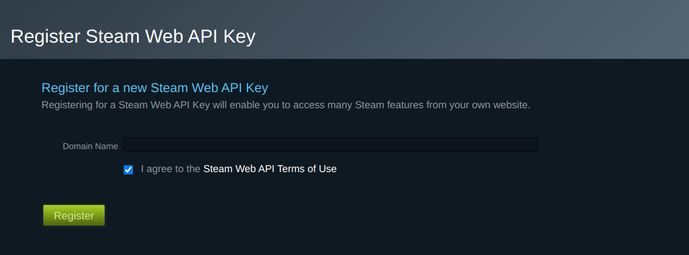
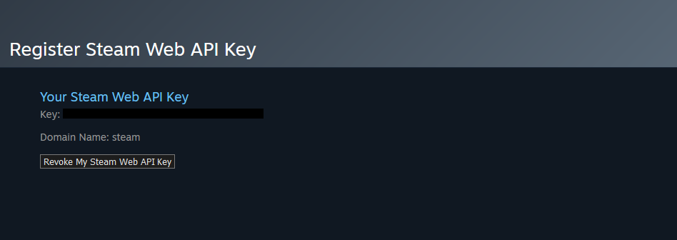
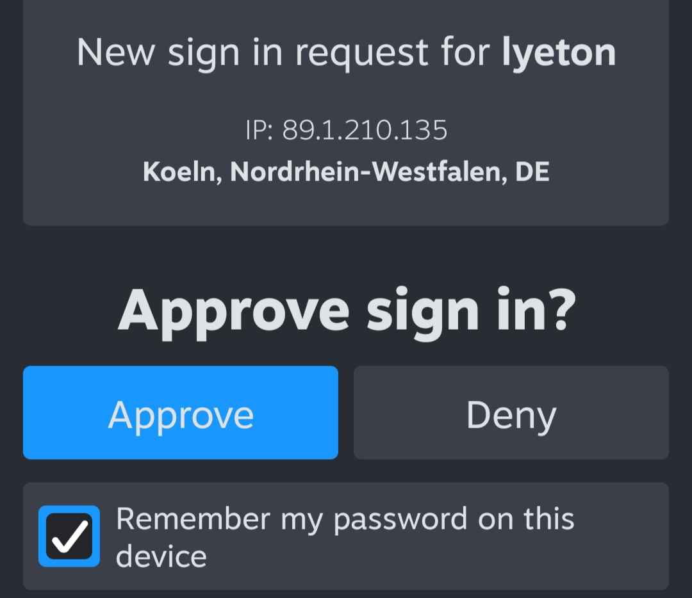

```{r, include = FALSE}
knitr::opts_chunk$set(
  collapse = TRUE,
  comment = "#>"
)
```

```{r setup}
library(steamr)
```

The Steam API is very inconsistent in the way it provides access to its services. Some functions do not need any identification, others require a Steam API key, and the most sensitive ones require you to be logged in. It is not always obvious which functions require which type of authentication, but `steamr` functions perform initial checks to ensure that authentication is given:

```{r include=FALSE}
options(steamr_do_auth = FALSE)
```

```{r error=TRUE}
get_userdata()
```

```{r include=FALSE}
options(steamr_do_auth = TRUE)
```


This vignette covers two package features: API keys and user authentication.


# API key

A Steam API key can be requested by any Steam account that has spent at least 5 USD in the Steam store. The account also needs to use two-factor authentication using the Steam mobile app. An API key can then be requested on Steam's developer site: [https://steamcommunity.com/dev/apikey]. You need to be logged in to request an API key.



After a successful request, an API key will be generated. You can view the API key anytime you visit Steam's dev site.



For use in `steamr`, set your API key as the environment variable `STEAM_API_KEY`. Requests sent to the Steam API will automatically fill in the `key` parameter.

```{r}
# Sys.setenv(STEAM_API_KEY = "XXXX")
get_steam_level("76561197960435530")
```

You can suppress this behavior by setting `options(steamr_do_auth = FALSE)`.

```{r error=TRUE}
options(steamr_do_auth = TRUE)
get_steam_level("76561197960435530")
```


# User authentication

User authentication is a bit more spicy. In more technical terms, authenticating a session means sending an access token with each request and setting the `sessionid`, `steamLoginSecure`, `steamCountry`, and `steamRefresh_steam` cookies. `steamr` achieves this through the functions `auth_credentials` and `auth_qr`. To login using either function, the Steam mobile app is required.

## Authentication using credentials

`auth_credentials` performs authentication by asking for username and password. The `password` argument accepts a function that safely asks for a password. This can be functions such as `askpass::askpass` or `rstudioapi::askForPassword` or any other prompt function that obfuscates the password string. The password is then RSA-encrypted using a Steam public key to ensure a secure transfer.


If the prompted password is correct, an authenticated session is initialized. Steam will now perform two-factor authentication using the Steam mobile app. You will receive a notification on your mobile device asking you to confirm the login request. Upon approval, `auth_credentials` will finalize the login and set the necessary cookies. As an alternative to manually approving each login request, you can also pass a Steam guard code using the `shared_secret` argument.




## Authentication using QR codes

Although `auth_credentials` takes great care of encrypting and obfuscating passwords wherever possible, passwords are still passed through the R session. To avoid entering passwords altogether, `auth_qr` can be used. This function requests a Steam login link and parses it as a QR code. This is essentially the same method that is used on Steam's login page ([https://store.steampowered.com/login/]).

The QR code is generated using the `qrcode` package and rendered as an R plot. This QR code can be scanned using the Steam mobile app to authenticate the session.

```{r echo=FALSE}
plot(qrcode::qr_code("this could be a steam login url"))
```

While this method avoids password prompts entirely, it depends on the ability to render and scan R plots interactively. At the end of the day, both functions require an interactive session and active user feedback.


## Persistent sessions

By default, authenticated sessions are ephemeral, they expire quickly and do not survive a session restart. They are stored in a temporary file and die when the R session ends. To persistently save a session for an undetermined time, you can use the `persistent` argument to `auth_credentials`. A persistent session takes longer to expire and is stored in a persistent directory. It uses `rappdirs::user_cache_dir()` to store authentication details and session cookies and is re-initialized when the package is loaded. Nonetheless, even persistent sessions expire at some point. To manually kill a stale session, you can use `logout()`. This deletes all information R has on the current authenticated session.
